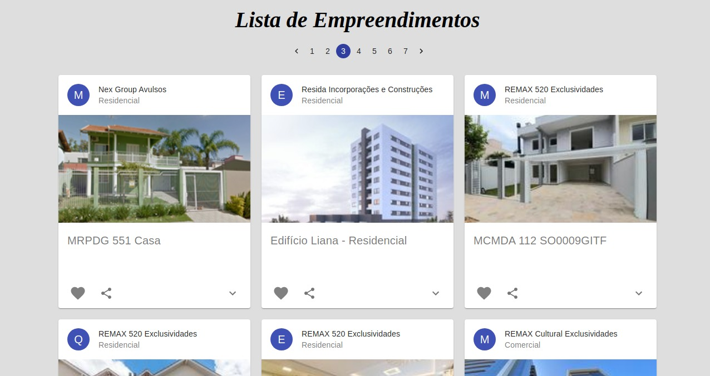

# favor-enterprises

List of favorite developments - Backend developed using Ruby on Rails, Frontend developed using React.

# how to use

    - Get access token and put it in the favor-enterprises/frontend/src/hooks/getBuildings.js ( API Docs: http://api.orulo.com.br.s3-website-us-east-1.amazonaws.com/#section/Introducao)

    - Install dependencies of the frontend and run npm start in the /frontend

    - Run Ruby on Rails Server in the /backend
